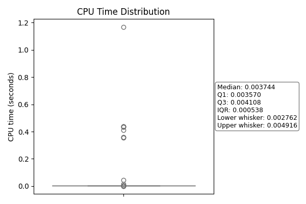

**Table 1：Statistics on the number of SAT solver invocations, the time spent on SAT solving, and the total runtime in the DivSampCA algorithm.**
| Instances             |   SAT_time(s) |   cpu_time(s) |   Number of SAT solver invocations |
|:---------------------|-----------:|-----------:|---------------------:|
| XSEngine.cnf         |   1.84675  |     11.545 |               134464 |
| aaed2000.cnf         |   2.19605  |     14.536 |               144753 |
| adder.cnf            |   1.90445  |     11.773 |               146866 |
| adderII.cnf          |   1.91232  |     11.832 |               147347 |
| aeb.cnf              |   1.72025  |     10.603 |               128019 |
| aim711.cnf           |   1.86577  |     11.623 |               136798 |
| aki3068net.cnf       |   1.77325  |     10.782 |               132634 |
| am31_sim.cnf         |   1.65048  |      9.887 |               125516 |
| asb.cnf              |   1.77435  |     10.974 |               134286 |
| asb2305.cnf          |   1.75405  |     10.824 |               134450 |
| assabet.cnf          |   1.92241  |     11.921 |               132353 |
| at91sam7sek.cnf      |   2.0156   |     13.344 |               134813 |
| at91sam7xek.cnf      |   2.18859  |     14.616 |               140602 |
| atlas_mips32_4kc.cnf |   1.95838  |     11.925 |               133623 |
| atlas_mips64_5kc.cnf |   1.87273  |     11.854 |               132939 |
| axtls.cnf            |   0.025918 |      0.101 |                 3289 |
| brutus.cnf           |   1.76048  |     10.929 |               128159 |
| buildroot.cnf        |   0.218    |      1.109 |                10006 |
| busybox_1_28_0.cnf   |   0.595049 |      4.763 |                 6665 |
| calm16_ceb.cnf       |   1.7093   |     10.149 |               126151 |
| calm32_ceb.cnf       |   1.66804  |      9.899 |               125974 |
| ceb_v850.cnf         |   1.69298  |     10.315 |               125628 |
| cerf.cnf             |   2.03612  |     13.046 |               138139 |
| cerfpda.cnf          |   2.12002  |     13.729 |               141002 |
| cma230.cnf           |   1.78509  |     11.157 |               127554 |
| cma28x.cnf           |   1.79043  |     10.971 |               134414 |
| cme555.cnf           |   1.95349  |     12.081 |               144143 |
| cq7708.cnf           |   1.9688   |     12.934 |               131028 |
| cq7750.cnf           |   1.86718  |     12.186 |               133854 |
| csb281.cnf           |   2.02504  |     12.381 |               142071 |
| dreamcast.cnf        |   1.96077  |     12.55  |               134780 |
| e7t.cnf              |   1.9967   |     12.519 |               138003 |
| ea2468.cnf           |   2.11244  |     15.177 |               144399 |
| eb40.cnf             |   1.82984  |     11.525 |               130344 |
| eb40a.cnf            |   1.88366  |     11.459 |               130497 |
| eb42.cnf             |   1.79704  |     11.448 |               130128 |
| eb55.cnf             |   1.8429   |     11.703 |               133781 |
| ebsa285.cnf          |   2.09717  |     12.937 |               138899 |
| ec555.cnf            |   1.88343  |     11.972 |               144257 |
| ecos-icse11.cnf      |   2.00681  |     11.712 |               134529 |
| edb7xxx.cnf          |   1.89854  |     11.92  |               134666 |
| edosk2674.cnf        |   1.75101  |     10.57  |               131112 |
| embtoolkit.cnf       |  14.8018   |    442.362 |               557766 |
| excalibur_arm9.cnf   |   2.05034  |     13.934 |               131849 |
| fads.cnf             |   1.69538  |     10.17  |               131237 |
| flexanet.cnf         |   2.025    |     13.118 |               137918 |
| freebsd-icse11.cnf   |   1.59835  |     15.661 |               120009 |
| frv400.cnf           |   1.85287  |     11.258 |               134288 |
| gps4020.cnf          |   1.76545  |     11.017 |               127907 |
| grg.cnf              |   1.81773  |     11.287 |               131118 |
| h8300h_sim.cnf       |   1.65618  |     10.038 |               126207 |
| h8max.cnf            |   1.84633  |     11.451 |               132225 |
| h8s_sim.cnf          |   1.65456  |      9.891 |               126118 |
| hs7729pci.cnf        |   2.25775  |     15.436 |               145852 |
| innovator.cnf        |   2.17158  |     14.098 |               139928 |
| integrator_arm7.cnf  |   1.9261   |     11.975 |               136943 |
| integrator_arm9.cnf  |   2.08829  |     13.616 |               138883 |
| ipaq.cnf             |   1.82147  |     11.631 |               132225 |
| iq80310.cnf          |   1.91709  |     12.103 |               133774 |
| iq80321.cnf          |   1.91463  |     12.008 |               133578 |
| ixdp425.cnf          |   1.88831  |     12.074 |               132201 |
| jmr3904.cnf          |   1.6993   |     10.238 |               128833 |
| jtst.cnf             |   1.81022  |     11.388 |               130785 |
| linux.cnf            |   1.98598  |     12.682 |               133108 |
| lpcmt.cnf            |   1.87714  |     12.2   |               131862 |
| m5272c3.cnf          |   2.08797  |     13.779 |               148571 |
| mac7100evb.cnf       |   1.7792   |     11.208 |               128801 |
| mace1.cnf            |   1.908    |     11.586 |               129060 |
| malta_mips32_4kc.cnf |   2.00661  |     12.454 |               138454 |
| malta_mips64_5kc.cnf |   2.00218  |     12.364 |               138192 |
| mb93091.cnf          |   2.03247  |     12.789 |               136098 |
| mb93093.cnf          |   1.97116  |     12.298 |               133757 |
| mbx.cnf              |   2.29995  |     14.817 |               151886 |
| mcb2100.cnf          |   1.86267  |     12.096 |               131824 |
| moab.cnf             |   2.0864   |     12.908 |               178419 |
| mpc50.cnf            |   1.72073  |     10.791 |               125722 |
| nano.cnf             |   2.06004  |     12.714 |               140562 |
| npwr.cnf             |   1.94389  |     12.443 |               133309 |
| ocelot.cnf           |   1.99957  |     12.719 |               140552 |
| olpce2294.cnf        |   2.01819  |     12.748 |               141572 |
| olpch2294.cnf        |   1.88664  |     11.733 |               132869 |
| olpcl2294.cnf        |   2.08673  |     13.258 |               138962 |
| p2106.cnf            |   1.87445  |     11.893 |               131828 |
| pati.cnf             |   1.88876  |     11.946 |               140729 |
| pc_i82544.cnf        |   2.07274  |     13.191 |               137114 |
| pc_i82559.cnf        |   2.06044  |     12.993 |               137002 |
| pc_rltk8139.cnf      |   2.17681  |     13.787 |               140002 |
| pc_usb_d12.cnf       |   1.98304  |     12.583 |               135047 |
| pc_vmWare.cnf        |   1.97683  |     12.483 |               134945 |
| phycore.cnf          |   1.9422   |     12.396 |               135743 |
| phycore229x.cnf      |   2.16987  |     14.67  |               146626 |
| picasso.cnf          |   1.90833  |     12.148 |               131385 |
| pid.cnf              |   1.74282  |     10.876 |               129469 |
| prpmc1100.cnf        |   1.69956  |     10.627 |               127146 |
| psim.cnf             |   1.67511  |     10.167 |               128981 |
| rattler.cnf          |   2.24742  |     14.248 |               151631 |
| ref4955.cnf          |   1.80433  |     11.174 |               131227 |
| refidt334.cnf        |   2.08041  |     12.867 |               144951 |
| sa1100mm.cnf         |   1.73566  |     10.887 |               128133 |
| sam7ex256.cnf        |   2.07732  |     14.291 |               140951 |
| se7751.cnf           |   2.15145  |     14.261 |               143242 |
| sh4_202_md.cnf       |   2.09564  |     13.945 |               139008 |
| sh7708.cnf           |   1.93276  |     12.821 |               132596 |
| skmb91302.cnf        |   1.73411  |     10.266 |               130061 |
| sleb.cnf             |   1.74267  |     10.419 |               126091 |
| smdk2410.cnf         |   2.12996  |     14.226 |               137610 |
| snds.cnf             |   1.81265  |     11.486 |               129201 |
| sparc_erc32.cnf      |   1.70279  |     10.362 |               123542 |
| sparc_leon.cnf       |   1.70702  |     10.211 |               123413 |
| sparclite_sim.cnf    |   1.65636  |      9.87  |               123192 |
| stb.cnf              |   1.88678  |     11.81  |               137514 |
| stdeval1.cnf         |   1.75747  |     10.717 |               128840 |
| stm3210e_eval.cnf    |   1.91447  |     12.195 |               134777 |
| toybox.cnf           |   0.043736 |      0.475 |                 3066 |
| ts1000.cnf           |   2.07079  |     12.998 |               152134 |
| ts6.cnf              |   1.97052  |     12.274 |               136098 |
| tx39_sim.cnf         |   1.6765   |     10.234 |               125911 |
| uClinux-config.cnf   |  35.951    |    878.324 |              1765971 |
| uClinux.cnf          |   0.24255  |      6.869 |                 2907 |
| uE250.cnf            |   1.9952   |     12.936 |               131111 |
| vads.cnf             |   2.02363  |     12.897 |               136260 |
| viper.cnf            |   2.14502  |     13.474 |               151955 |
| vrc4373.cnf          |   1.97018  |     12.487 |               135177 |
| vrc4375.cnf          |   2.1351   |     13.789 |               140330 |

**Table 2：Statistics of the benchmark regarding the number of variables and clauses, the distribution of clause lengths, the density (clauses/variables), and the proportion of clauses classified by length.**
| Instances            |   tuple_num |   variables |   clauses |   median_len |   min_len |   max_len |   density |    2-CNF |    3-CNF |   >3-CNF |
|:---------------------|------------:|------------:|----------:|-------------:|----------:|----------:|----------:|---------:|---------:|---------:|
| aaed2000.cnf         |     2974825 |        1284 |     50512 |            7 |         1 |        14 | 39.3396   | 0.046642 | 0.001505 | 0.951853 |
| adder.cnf            |     3077396 |        1272 |      3201 |            2 |         1 |         5 |  2.51651  | 0.74258  | 0.022805 | 0.234614 |
| adderII.cnf          |     3040048 |        1276 |      3206 |            2 |         1 |         5 |  2.51254  | 0.742982 | 0.02277  | 0.234248 |
| aeb.cnf              |     3059606 |        1213 |      3767 |            2 |         1 |        14 |  3.10552  | 0.597558 | 0.019113 | 0.383329 |
| aim711.cnf           |     2722566 |        1264 |      3873 |            2 |         1 |        14 |  3.06408  | 0.606765 | 0.018332 | 0.374903 |
| aki3068net.cnf       |     2987322 |        1207 |      3080 |            2 |         1 |         5 |  2.55178  | 0.727273 | 0.020779 | 0.251948 |
| am31_sim.cnf         |     2725375 |        1165 |      2968 |            2 |         1 |         5 |  2.54764  | 0.726752 | 0.022237 | 0.251011 |
| asb.cnf              |     2518806 |        1231 |      3081 |            2 |         1 |         5 |  2.50284  | 0.733853 | 0.02272  | 0.243427 |
| asb2305.cnf          |     2812382 |        1242 |      3101 |            2 |         1 |         5 |  2.49678  | 0.735247 | 0.022573 | 0.24218  |
| assabet.cnf          |     2843643 |        1266 |      3883 |            2 |         1 |        14 |  3.06714  | 0.605975 | 0.019572 | 0.374453 |
| at91sam7sek.cnf      |     2939079 |        1296 |      3921 |            2 |         1 |        14 |  3.02546  | 0.610303 | 0.019893 | 0.369804 |
| at91sam7xek.cnf      |     3071870 |        1319 |      3963 |            2 |         1 |        14 |  3.00455  | 0.613424 | 0.019682 | 0.366894 |
| atlas_mips32_4kc.cnf |     3217676 |        1216 |      3078 |            2 |         1 |         5 |  2.53125  | 0.731644 | 0.022742 | 0.245614 |
| atlas_mips64_5kc.cnf |     2764804 |        1209 |      3066 |            2 |         1 |         5 |  2.53598  | 0.730594 | 0.022831 | 0.246575 |
| axtls.cnf            |     2732018 |          94 |       190 |            2 |         1 |         5 |  2.02128  | 0.784211 | 0.142105 | 0.073684 |
| brutus.cnf           |       16212 |        1221 |      3754 |            2 |         1 |        14 |  3.07453  | 0.601758 | 0.020511 | 0.37773  |
| buildroot.cnf        |     2753311 |         565 |      1164 |            2 |         2 |       533 |  2.06018  | 0.957045 | 0.040378 | 0.002577 |
| busybox_1_28_0.cnf   |      621270 |         998 |       962 |            2 |         1 |       124 |  0.963928 | 0.731809 | 0.14553  | 0.122661 |
| calm16_ceb.cnf       |     1965023 |        1173 |      2990 |            2 |         1 |         5 |  2.54902  | 0.727759 | 0.022742 | 0.249498 |
| calm32_ceb.cnf       |     2552819 |        1173 |      2990 |            2 |         1 |         5 |  2.54902  | 0.727759 | 0.022742 | 0.249498 |
| ceb_v850.cnf         |     2552819 |        1189 |      3025 |            2 |         1 |         5 |  2.54415  | 0.730579 | 0.02281  | 0.246612 |
| cerf.cnf             |     2632319 |        1276 |      3910 |            2 |         1 |        14 |  3.06426  | 0.605882 | 0.02046  | 0.373657 |
| cerfpda.cnf          |     3023738 |        1291 |      3940 |            2 |         1 |        14 |  3.0519   | 0.608883 | 0.020305 | 0.370812 |
| cma230.cnf           |     3096965 |        1212 |      3739 |            2 |         1 |        14 |  3.08498  | 0.600695 | 0.020326 | 0.378978 |
| cma28x.cnf           |     2718034 |        1204 |      3051 |            2 |         1 |         5 |  2.53405  | 0.733202 | 0.022943 | 0.243854 |
| cme555.cnf           |     2694432 |        1266 |      3167 |            2 |         1 |         5 |  2.50158  | 0.735712 | 0.020208 | 0.24408  |
| cq7708.cnf           |     2987068 |        1238 |     49770 |            7 |         1 |         7 | 40.2019   | 0.046172 | 0.001386 | 0.952441 |
| cq7750.cnf           |     2833809 |        1267 |      3173 |            2 |         1 |         5 |  2.50434  | 0.732745 | 0.021746 | 0.245509 |
| csb281.cnf           |     2945323 |        1233 |      3114 |            2 |         1 |         5 |  2.52555  | 0.733462 | 0.022479 | 0.244059 |
| dreamcast.cnf        |     2873486 |        1252 |      3168 |            2 |         1 |         5 |  2.53035  | 0.732639 | 0.02178  | 0.245581 |
| e7t.cnf              |     2908040 |        1266 |      3816 |            2 |         1 |        14 |  3.01422  | 0.606132 | 0.019916 | 0.373952 |
| ea2468.cnf           |     2998580 |        1395 |      4138 |            2 |         1 |        14 |  2.96631  | 0.621798 | 0.017641 | 0.360561 |
| eb40.cnf             |     3445241 |        1240 |      3816 |            2 |         1 |        14 |  3.07742  | 0.602201 | 0.018868 | 0.378931 |
| eb40a.cnf            |     2845284 |        1241 |      3817 |            2 |         1 |        14 |  3.07574  | 0.602305 | 0.018863 | 0.378832 |
| eb42.cnf             |     2850007 |        1234 |      3779 |            2 |         1 |        14 |  3.0624   | 0.604393 | 0.020111 | 0.375496 |
| eb55.cnf             |     2816657 |        1270 |      3882 |            2 |         1 |        14 |  3.05669  | 0.607161 | 0.019062 | 0.373776 |
| ebsa285.cnf          |     2972652 |        1245 |      3832 |            2 |         1 |        14 |  3.07791  | 0.602296 | 0.019311 | 0.378392 |
| ec555.cnf            |     2928811 |        1267 |      3169 |            2 |         1 |         5 |  2.50118  | 0.735879 | 0.020196 | 0.243926 |
| ecos-icse11.cnf      |     2991912 |        1244 |      3146 |            2 |         1 |         5 |  2.52894  | 0.732676 | 0.020343 | 0.24698  |
| edb7xxx.cnf          |     2910229 |        1246 |      3812 |            2 |         1 |        14 |  3.05939  | 0.605456 | 0.019937 | 0.374607 |
| edosk2674.cnf        |     2883125 |        1194 |      3034 |            2 |         1 |         5 |  2.54104  | 0.730719 | 0.022413 | 0.246869 |
| embtoolkit.cnf       |     2664906 |        2128 |     15483 |            3 |         1 |       113 |  7.27585  | 0.343086 | 0.578312 | 0.078602 |
| excalibur_arm9.cnf   |     8256603 |        1233 |     50538 |            7 |         1 |        14 | 40.9878   | 0.044936 | 0.001504 | 0.95356  |
| fads.cnf             |     2811553 |        1187 |      3008 |            2 |         1 |         5 |  2.53412  | 0.730053 | 0.022606 | 0.24734  |
| flexanet.cnf         |     2616878 |        1265 |      3883 |            2 |         1 |        14 |  3.06956  | 0.606232 | 0.01983  | 0.373938 |
| freebsd-icse11.cnf   |     2993782 |        1396 |     62183 |           16 |         1 |        30 | 44.5437   | 0.026293 | 0.019893 | 0.953814 |
| frv400.cnf           |     3765597 |        1238 |      3096 |            2 |         1 |         5 |  2.50081  | 0.734173 | 0.022933 | 0.242894 |
| gps4020.cnf          |     2877936 |        1213 |      3743 |            2 |         1 |        14 |  3.08574  | 0.600053 | 0.020305 | 0.379642 |
| grg.cnf              |     2717800 |        1241 |      3792 |            2 |         1 |        14 |  3.0556   | 0.603376 | 0.020042 | 0.376582 |
| h8300h_sim.cnf       |     2874004 |        1182 |      3001 |            2 |         1 |         5 |  2.53892  | 0.72909  | 0.021993 | 0.248917 |
| h8max.cnf            |     2580312 |        1202 |      3072 |            2 |         1 |         5 |  2.55574  | 0.726562 | 0.020833 | 0.252604 |
| h8s_sim.cnf          |     2701971 |        1183 |      3003 |            2 |         1 |         5 |  2.53846  | 0.729271 | 0.021978 | 0.248751 |
| hs7729pci.cnf        |     2584875 |        1298 |     49911 |            7 |         1 |         7 | 38.4522   | 0.047825 | 0.001222 | 0.950953 |
| innovator.cnf        |     3150211 |        1256 |     50452 |            7 |         1 |        14 | 40.1688   | 0.045568 | 0.001506 | 0.952926 |
| integrator_arm7.cnf  |     2951515 |        1259 |      3939 |            2 |         1 |        14 |  3.12867  | 0.588728 | 0.019294 | 0.391978 |
| integrator_arm9.cnf  |     2957100 |        1267 |     50606 |            7 |         1 |        14 | 39.9416   | 0.046081 | 0.001502 | 0.952417 |
| ipaq.cnf             |     2998857 |        1258 |      3868 |            2 |         1 |        14 |  3.07472  | 0.605739 | 0.018356 | 0.375905 |
| iq80310.cnf          |     2897450 |        1258 |      3821 |            2 |         1 |        14 |  3.03736  | 0.607433 | 0.01989  | 0.372677 |
| iq80321.cnf          |     2960510 |        1256 |      3820 |            2 |         1 |        14 |  3.0414   | 0.60733  | 0.019895 | 0.372775 |
| ixdp425.cnf          |     2950754 |        1247 |      3799 |            2 |         1 |        14 |  3.04651  | 0.604633 | 0.020005 | 0.375362 |
| jmr3904.cnf          |     2902858 |        1199 |      3035 |            2 |         1 |         5 |  2.53128  | 0.731796 | 0.022405 | 0.245799 |
| jtst.cnf             |     2664287 |        1241 |      3818 |            2 |         1 |        14 |  3.07655  | 0.60241  | 0.018858 | 0.378732 |
| linux.cnf            |     2849989 |        1232 |      3154 |            2 |         1 |         5 |  2.56006  | 0.720355 | 0.020926 | 0.258719 |
| lpcmt.cnf            |     2797796 |        1249 |      3824 |            2 |         1 |        14 |  3.06165  | 0.60251  | 0.019351 | 0.378138 |
| m5272c3.cnf          |     2887921 |        1323 |      3297 |            2 |         1 |         6 |  2.49206  | 0.74401  | 0.024264 | 0.231726 |
| mac7100evb.cnf       |     3277333 |        1234 |      3770 |            2 |         1 |        14 |  3.05511  | 0.603714 | 0.020159 | 0.376127 |
| mace1.cnf            |     2817536 |        1234 |      3770 |            2 |         1 |        14 |  3.05511  | 0.603714 | 0.020159 | 0.376127 |
| malta_mips32_4kc.cnf |     2817536 |        1232 |      3213 |            2 |         1 |         5 |  2.60796  | 0.707439 | 0.021786 | 0.270775 |
| malta_mips64_5kc.cnf |     2837755 |        1232 |      3212 |            2 |         1 |         5 |  2.60714  | 0.707347 | 0.021793 | 0.270859 |
| mb93091.cnf          |     2837834 |        1250 |      3131 |            2 |         1 |         5 |  2.5048   | 0.732993 | 0.023954 | 0.243053 |
| mb93093.cnf          |     2928306 |        1230 |      3083 |            2 |         1 |         5 |  2.5065   | 0.733052 | 0.02303  | 0.243918 |
| mbx.cnf              |     2839740 |        1295 |      3218 |            2 |         1 |         5 |  2.48494  | 0.744251 | 0.022374 | 0.233375 |
| mcb2100.cnf          |     3152444 |        1249 |      3824 |            2 |         1 |        14 |  3.06165  | 0.60251  | 0.019351 | 0.378138 |
| moab.cnf             |     2887921 |        1277 |      3249 |            2 |         1 |         5 |  2.54424  | 0.73438  | 0.022161 | 0.24346  |
| mpc50.cnf            |     3061614 |        1213 |      3728 |            2 |         1 |        14 |  3.07337  | 0.599517 | 0.01985  | 0.380633 |
| nano.cnf             |     2719748 |        1265 |      3870 |            2 |         1 |        14 |  3.05929  | 0.605168 | 0.018863 | 0.375969 |
| npwr.cnf             |     3016264 |        1258 |      3822 |            2 |         1 |        14 |  3.03816  | 0.607535 | 0.019885 | 0.37258  |
| ocelot.cnf           |     2960866 |        1266 |      3141 |            2 |         1 |         5 |  2.48104  | 0.737345 | 0.022923 | 0.239733 |
| olpce2294.cnf        |     2986129 |        1274 |      3881 |            2 |         1 |        14 |  3.04631  | 0.607318 | 0.019067 | 0.373615 |
| olpch2294.cnf        |     3037775 |        1261 |      3851 |            2 |         1 |        14 |  3.05393  | 0.604778 | 0.019216 | 0.376006 |
| olpcl2294.cnf        |     2945759 |        1273 |      3878 |            2 |         1 |        14 |  3.04635  | 0.606756 | 0.019082 | 0.374162 |
| p2106.cnf            |     3033027 |        1249 |      3824 |            2 |         1 |        14 |  3.06165  | 0.60251  | 0.019351 | 0.378138 |
| pati.cnf             |     2887921 |        1248 |      3266 |            2 |         1 |         5 |  2.61699  | 0.708206 | 0.019596 | 0.272198 |
| pc_i82544.cnf        |     2901007 |        1259 |      3179 |            2 |         1 |         5 |  2.52502  | 0.735137 | 0.020132 | 0.244731 |
| pc_i82559.cnf        |     2977432 |        1259 |      3179 |            2 |         1 |         5 |  2.52502  | 0.735137 | 0.020132 | 0.244731 |
| pc_rltk8139.cnf      |     2977432 |        1257 |      3179 |            2 |         1 |         5 |  2.52904  | 0.734508 | 0.020132 | 0.24536  |
| pc_usb_d12.cnf       |     2997551 |        1281 |      3231 |            2 |         1 |         6 |  2.52225  | 0.736614 | 0.022903 | 0.240483 |
| pc_vmWare.cnf        |     3054130 |        1255 |      3174 |            2 |         1 |         5 |  2.52908  | 0.73472  | 0.020164 | 0.245117 |
| phycore.cnf          |     2959321 |        1274 |      3852 |            2 |         1 |        14 |  3.02355  | 0.605919 | 0.018692 | 0.375389 |
| phycore229x.cnf      |     3008140 |        1360 |      4026 |            2 |         1 |        14 |  2.96029  | 0.618728 | 0.019622 | 0.361649 |
| picasso.cnf          |     3353009 |        1248 |      3808 |            2 |         1 |        14 |  3.05128  | 0.60583  | 0.019958 | 0.374212 |
| pid.cnf              |     2888912 |        1229 |      3778 |            2 |         1 |        14 |  3.07404  | 0.603229 | 0.020116 | 0.376654 |
| prpmc1100.cnf        |     2787898 |        1223 |      3754 |            2 |         1 |        14 |  3.0695   | 0.600959 | 0.020245 | 0.378796 |
| psim.cnf             |     2763534 |        1181 |      2995 |            2 |         1 |         5 |  2.53599  | 0.729215 | 0.022371 | 0.248414 |
| rattler.cnf          |     2591638 |        1311 |      3245 |            2 |         1 |         5 |  2.47521  | 0.746071 | 0.02188  | 0.232049 |
| ref4955.cnf          |     3269503 |        1218 |      3099 |            2 |         1 |         5 |  2.54433  | 0.729268 | 0.021297 | 0.249435 |
| refidt334.cnf        |     2752784 |        1263 |      3140 |            2 |         1 |         5 |  2.48614  | 0.737261 | 0.022611 | 0.240127 |
| sa1100mm.cnf         |     3022264 |        1222 |      3760 |            2 |         1 |        14 |  3.07692  | 0.602128 | 0.020479 | 0.377394 |
| sam7ex256.cnf        |     2760267 |        1332 |      3989 |            2 |         1 |        14 |  2.99474  | 0.61469  | 0.019554 | 0.365756 |
| se7751.cnf           |     3251255 |        1295 |      3254 |            2 |         1 |         5 |  2.51274  | 0.731715 | 0.019975 | 0.24831  |
| sh4_202_md.cnf       |     3113003 |        1258 |      3196 |            2 |         1 |         5 |  2.54054  | 0.732478 | 0.021589 | 0.245932 |
| sh7708.cnf           |     2953597 |        1253 |     49851 |            7 |         1 |         7 | 39.7853   | 0.046719 | 0.001224 | 0.952057 |
| skmb91302.cnf        |     2900913 |        1217 |      3052 |            2 |         1 |         5 |  2.50781  | 0.732634 | 0.02228  | 0.245085 |
| sleb.cnf             |     2755776 |        1188 |      3009 |            2 |         1 |         5 |  2.53283  | 0.730475 | 0.021934 | 0.247591 |
| smdk2410.cnf         |     2624832 |        1265 |     50468 |            7 |         1 |        14 | 39.8957   | 0.04591  | 0.001506 | 0.952584 |
| snds.cnf             |     2963036 |        1218 |      3748 |            2 |         1 |        14 |  3.07718  | 0.599787 | 0.019744 | 0.38047  |
| sparclite_sim.cnf    |     2757180 |        1168 |      2972 |            2 |         1 |         5 |  2.54452  | 0.72712  | 0.022207 | 0.250673 |
| sparc_erc32.cnf      |     2534598 |        1168 |      2972 |            2 |         1 |         5 |  2.54452  | 0.72712  | 0.022207 | 0.250673 |
| sparc_leon.cnf       |     2534598 |        1168 |      2972 |            2 |         1 |         5 |  2.54452  | 0.72712  | 0.022207 | 0.250673 |
| stb.cnf              |     2534598 |        1252 |      3146 |            2 |         1 |         5 |  2.51278  | 0.732676 | 0.020979 | 0.246345 |
| stdeval1.cnf         |     2916752 |        1190 |      3049 |            2 |         1 |         5 |  2.56218  | 0.72614  | 0.02099  | 0.25287  |
| stm3210e_eval.cnf    |     2634044 |        1269 |      3200 |            2 |         1 |         5 |  2.52167  | 0.735625 | 0.022187 | 0.242188 |
| toybox.cnf           |     3004138 |         544 |      1020 |            2 |         1 |         4 |  1.875    | 0.467647 | 0.109804 | 0.422549 |
| ts1000.cnf           |      256494 |        1297 |      3218 |            2 |         1 |         5 |  2.48111  | 0.744562 | 0.022374 | 0.233064 |
| ts6.cnf              |     3167286 |        1240 |      3235 |            2 |         1 |         5 |  2.60887  | 0.710355 | 0.021947 | 0.267697 |
| tx39_sim.cnf         |     2896324 |        1179 |      2988 |            2 |         1 |         5 |  2.53435  | 0.727912 | 0.022088 | 0.25     |
| uClinux-config.cnf   |     2571192 |       11254 |     31637 |            3 |         1 |        16 |  2.81118  | 0.307267 | 0.307678 | 0.385055 |
| uClinux.cnf          |   134039737 |        1850 |      2468 |            1 |         1 |         2 |  1.33405  | 0.5      | 0        | 0.5      |
| uE250.cnf            |     3013528 |        1249 |      3810 |            2 |         1 |        14 |  3.05044  | 0.606037 | 0.019948 | 0.374016 |
| vads.cnf             |     2893698 |        1240 |      3235 |            2 |         1 |         5 |  2.60887  | 0.710355 | 0.021947 | 0.267697 |
| viper.cnf            |     2896324 |        1301 |      3230 |            2 |         1 |         5 |  2.48271  | 0.745201 | 0.022291 | 0.232508 |
| vrc4373.cnf          |     3182447 |        1247 |      3104 |            2 |         1 |         5 |  2.48917  | 0.735825 | 0.022552 | 0.241624 |
| vrc4375.cnf          |     2884611 |        1258 |      3129 |            2 |         1 |         5 |  2.48728  | 0.737296 | 0.022371 | 0.240332 |
| XSEngine.cnf         |     2968972 |        1260 |      3803 |            2 |         1 |        14 |  3.01825  | 0.606363 | 0.019984 | 0.373652 |

**Figure 1: Overview of CNF benchmark scale and structure—number of variables, clauses, density, and clause-length distribution.**

**Table3：The time taken by a single invocation of the MiniSat solver to solve each instance.**

| Instances             |cpu_time(s) |
|:---------------------|-----------:|
| XSEngine.cnf         |   0.004272 |
| aaed2000.cnf         |   0.410448 |
| adder.cnf            |   0.00433  |
| adderII.cnf          |   0.003549 |
| aeb.cnf              |   0.003789 |
| aim711.cnf           |   0.004    |
| aki3068net.cnf       |   0.00351  |
| am31_sim.cnf         |   0.003516 |
| asb.cnf              |   0.004133 |
| asb2305.cnf          |   0.003571 |
| assabet.cnf          |   0.003855 |
| at91sam7sek.cnf      |   0.003784 |
| at91sam7xek.cnf      |   0.003927 |
| atlas_mips32_4kc.cnf |   0.003523 |
| atlas_mips64_5kc.cnf |   0.003688 |
| axtls.cnf            |   0.002011 |
| brutus.cnf           |   0.003697 |
| buildroot.cnf        |   0.003055 |
| busybox_1_28_0.cnf   |   0.002579 |
| calm16_ceb.cnf       |   0.003583 |
| calm32_ceb.cnf       |   0.003539 |
| ceb_v850.cnf         |   0.004238 |
| cerf.cnf             |   0.003772 |
| cerfpda.cnf          |   0.0041   |
| cma230.cnf           |   0.00152  |
| cma28x.cnf           |   0.003591 |
| cme555.cnf           |   0.00357  |
| cq7708.cnf           |   0.360367 |
| cq7750.cnf           |   0.004306 |
| csb281.cnf           |   0.004281 |
| dreamcast.cnf        |   0.003823 |
| e7t.cnf              |   0.003742 |
| ea2468.cnf           |   0.004134 |
| eb40.cnf             |   0.004103 |
| eb40a.cnf            |   0.004656 |
| eb42.cnf             |   0.003788 |
| eb55.cnf             |   0.003978 |
| ebsa285.cnf          |   0.003685 |
| ec555.cnf            |   0.003615 |
| ecos-icse11.cnf      |   0.00352  |
| edb7xxx.cnf          |   0.003807 |
| edosk2674.cnf        |   0.004354 |
| embtoolkit.cnf       |   0.013074 |
| excalibur_arm9.cnf   |   0.433771 |
| fads.cnf             |   0.003488 |
| flexanet.cnf         |   0.004067 |
| freebsd-icse11.cnf   |   1.16847  |
| frv400.cnf           |   0.003518 |
| gps4020.cnf          |   0.003851 |
| grg.cnf              |   0.004441 |
| h8300h_sim.cnf       |   0.004705 |
| h8max.cnf            |   0.0036   |
| h8s_sim.cnf          |   0.003374 |
| hs7729pci.cnf        |   0.359918 |
| innovator.cnf        |   0.435867 |
| integrator_arm7.cnf  |   0.001736 |
| integrator_arm9.cnf  |   0.437981 |
| ipaq.cnf             |   0.003945 |
| iq80310.cnf          |   0.003826 |
| iq80321.cnf          |   0.003967 |
| ixdp425.cnf          |   0.003732 |
| jmr3904.cnf          |   0.003435 |
| jtst.cnf             |   0.00376  |
| linux.cnf            |   0.00422  |
| lpcmt.cnf            |   0.003891 |
| m5272c3.cnf          |   0.003746 |
| mac7100evb.cnf       |   0.003635 |
| mace1.cnf            |   0.004143 |
| malta_mips32_4kc.cnf |   0.003656 |
| malta_mips64_5kc.cnf |   0.001672 |
| mb93091.cnf          |   0.004537 |
| mb93093.cnf          |   0.003596 |
| mbx.cnf              |   0.003616 |
| mcb2100.cnf          |   0.003757 |
| moab.cnf             |   0.003813 |
| mpc50.cnf            |   0.003737 |
| nano.cnf             |   0.003716 |
| npwr.cnf             |   0.003807 |
| ocelot.cnf           |   0.003549 |
| olpce2294.cnf        |   0.00357  |
| olpch2294.cnf        |   0.004124 |
| olpcl2294.cnf        |   0.003914 |
| p2106.cnf            |   0.00381  |
| pati.cnf             |   0.004348 |
| pc_i82544.cnf        |   0.003775 |
| pc_i82559.cnf        |   0.00363  |
| pc_rltk8139.cnf      |   0.003611 |
| pc_usb_d12.cnf       |   0.003586 |
| pc_vmWare.cnf        |   0.003532 |
| phycore.cnf          |   0.003699 |
| phycore229x.cnf      |   0.003896 |
| picasso.cnf          |   0.004402 |
| pid.cnf              |   0.003736 |
| prpmc1100.cnf        |   0.003743 |
| psim.cnf             |   0.003692 |
| rattler.cnf          |   0.004471 |
| ref4955.cnf          |   0.00104  |
| refidt334.cnf        |   0.003696 |
| sa1100mm.cnf         |   0.003512 |
| sam7ex256.cnf        |   0.001964 |
| se7751.cnf           |   0.003416 |
| sh4_202_md.cnf       |   0.003805 |
| sh7708.cnf           |   0.354751 |
| skmb91302.cnf        |   0.001785 |
| sleb.cnf             |   0.003543 |
| smdk2410.cnf         |   0.437522 |
| snds.cnf             |   0.003896 |
| sparc_erc32.cnf      |   0.003193 |
| sparc_leon.cnf       |   0.00431  |
| sparclite_sim.cnf    |   0.001065 |
| stb.cnf              |   0.003663 |
| stdeval1.cnf         |   0.003585 |
| stm3210e_eval.cnf    |   0.003675 |
| toybox.cnf           |   0.002293 |
| ts1000.cnf           |   0.004088 |
| ts6.cnf              |   0.003712 |
| tx39_sim.cnf         |   0.001696 |
| uClinux-config.cnf   |   0.043928 |
| uClinux.cnf          |   0.003068 |
| uE250.cnf            |   0.003708 |
| vads.cnf             |   0.004394 |
| viper.cnf            |   0.003842 |
| vrc4373.cnf          |   0.003561 |
| vrc4375.cnf          |   0.003569 |

**Figure 2: Boxplot of solving times for 124 CNF instances.  
The plot marks the median, quartiles, inter-quartile range, and upper/lower whiskers, illustrating the distribution range and dispersion of solving times.**

